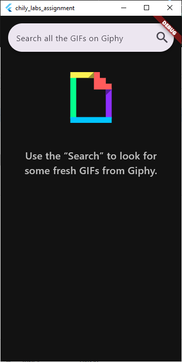
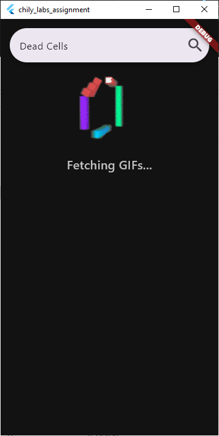
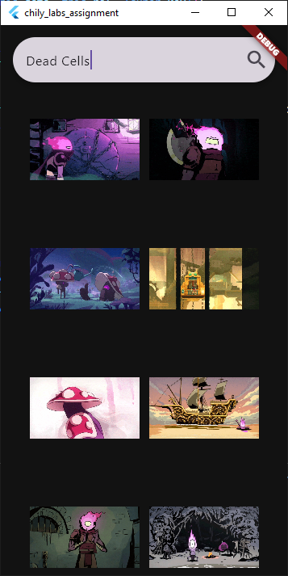
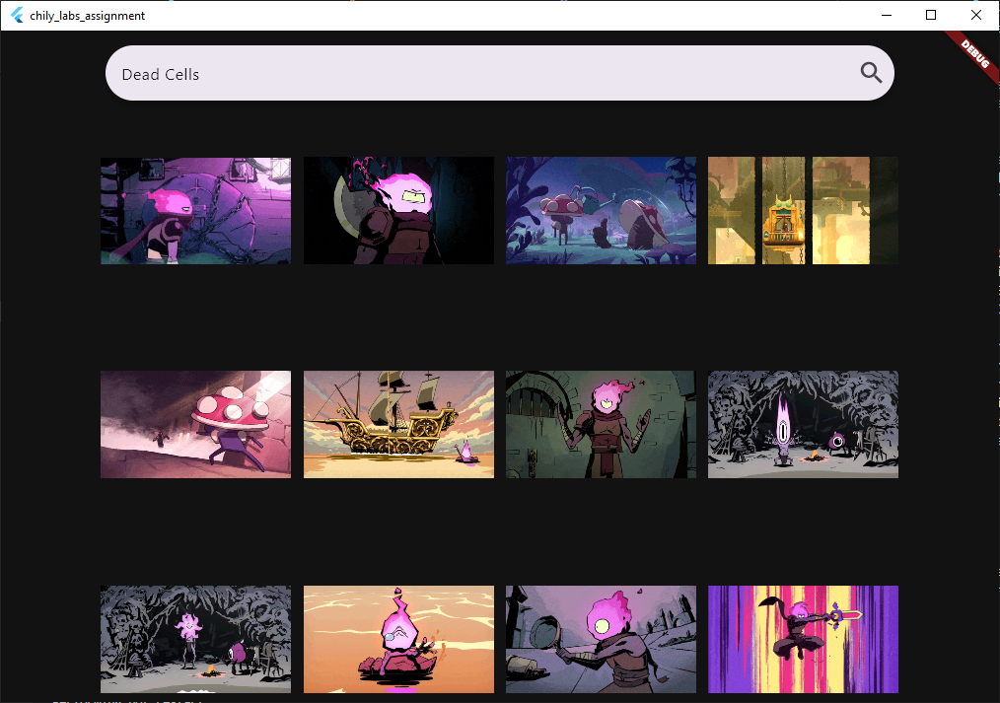
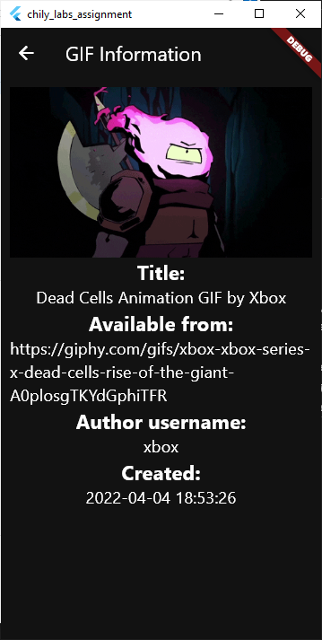

# chili_labs_assignment - Junior Mobile Developer position assignment

## Information regarding Flutter SDK
Flutter 3.22.3 • channel stable • https://github.com/flutter/flutter.git

Framework • revision b0850beeb2 (5 days ago) • 2024-07-16 21:43:41 -0700

Engine • revision 235db911ba

Tools • Dart 3.4.4 • DevTools 2.34.3

## The Task - Create a gif search application using the Giphy service.

### Primary Requirements:

### Techical
- Primary platforms - iOS & Android _(added Platfrom checks for different APIs)_;
- Auto search - requests to retrieve Gif information from the service are made automatically with a small delay after user stops typing _(added 1.5s timer)_;
- Pagination - loading more results when scrolling _(added ScrollController listener)_;
- Vertical & horizontal orientation support _(GridView CrossAxis amount changes based on orientation)_;
- Error handling _(added checks for different HTTP response codes, error in API execution and widgets)_;
- Unit tests - as much as you see fit _(added simple Unit tests for app essentials and HTTP request mock up)_.

### UI
- Responsive & matching platform guidelines _(I hope?)_;
- At least 2 views sourced by data from Giphy _(Sourced original and downscaled views)_;
- Results are displayed in a grid _(used GridView.builder)_;
- Clicking on a grid item should navigate to a detailed Gif view _(clicking an item opens another Scaffold widget with detailed information about GIF)_;
- Loading indicators _(added widget when fetching data)_;
- Error display _(added widget when receiving error)_.

### Bonus points:
- Using state management approaches or libraries such as BLoC (flutter_bloc), Riverpod or others _(Riverpod has been used)_;
- Using an understandable architecture pattern;
- Page navigation is separate from page widget code (a Coordinator pattern or similar);
- Network availability handling _(sort of? request is not being proceeded due to network issues - returns 400 HTTP response code)_.

### Feedback & Comments:
- On scroll too many requests are being made when trying to load more gifs _(this was based on limit of the API request, initial was 10, now changed to 30)_;
- Scrolling to the bottom lacks loading indicator of loading more gifs _(added loading indicator)_;
- ~~To avoid human errors when parsing data from network, it’s better to leave it to dedicated tools like json_serializable, freezed which conveniently generates all the necessary code in a clean manner~~ **(tried to create it with freezed package, but unable to accomplish it due to many errors after executing build_runner)**;
- Using outdated package versions, e.g., flutter_svg (inadvisable unless there’s specific reason for it) _(updated dependencies version in pubspec.yaml)_;
- Although this is a test task, good practice is to avoid exposing public api keys in code. Can inject them during runtime by passing additional arguments _(even though they weren't exposed as such on GitHub Repository, they were crucial to compile the project on other machine, because of that they were shared in Configuration file .ZIP archive personally)_.

## Preview

    
    
    
    
    
    

